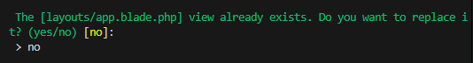
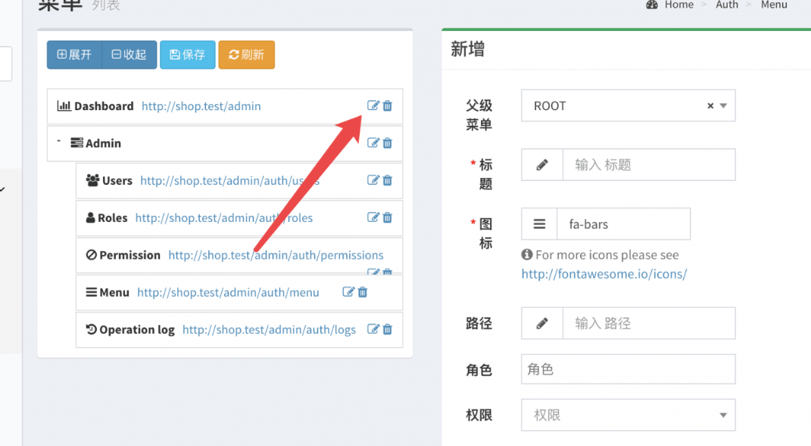

### 辅助函数
1.一般在app/helpers.php里写
例如 
    function test_helper(){
        return 'ok';
    }

2.引入
    在composer.json里的autoload里创建files字段
    "files":[
        'app/helpers.php'
    ]
    执行composer dumputoload
3.测试
    输入php artisan tinker
    输入test_helpers()

### 清除缓存
npm cache clean --force

### 安装依赖
npm install

-------------------------------------------------------------------
## Laravel Mix
是一款前端任务自动化管理工具，使用了工作流的模式对制定好的任务依次执行。Mix支持许多常见的CSS与JS预处理器，使用Mix的前提是安装了npm依赖
### 在webpack.mix.js添加.versions(),每次Mix生成静态文件都会加上一个版本号，避免浏览器缓存
mix.js('resources/js/app.js', 'public/js')
  .vue()
  .sass('resources/sass/app.scss', 'public/css')
  .version();
### 编译mix文件,我们在resource/views里写的.blade.php文件 都需要通过mix继续编译，然后他会在public文件夹里生成样式，直接查看
npm run watch-poll ## 实时编译
npm run dev ##仅编译一次

-------------------------------------------------------------------
## 用户认证功能
### Laravel自带了用户认证脚手架
### 创建用户认证页面
    php artisan ui:auth
    如果你已经在layouts里面自定义了主要布局文件——app.blade.php 那他提示是否需要覆盖的时候，你应该回答no
### 会生成多余的home页面，所以我们要删除
    1.在routes/web.php 删除  Route::get('/home', 'HomeController@index')->name('home');
    2.删除app/Http/Controllers/HomeController.php 和 resources/views/home.blade.php两个文件
    3.将 app/Providers/RouteServiceProvicder.php 里的 public const HOME = '/home'; 改成 public const HOME = '/';
### 修改网站的.conf文件（nginx的话）
    location / {
        try_files $uri $uri/ /index.php?$query_string;
    }

    修改成

    location / {
        try_files $uri $uri/ /index.php?$query_string;
    }
### 加上邮箱验证功能
    1.在app/Models/User.php里加上 implements MustVerifyEmail
        class User extends Authenticatable implements MustVerifyEmail
    2.在routes/web.php修改
        // Laravel 的用户认证路由
        Auth::routes(['verify' => true]);
    3.再路由上加上verified中间件，如果一个未完成验证的用户尝试访问路由，中间件就会提示用户进行邮箱的验证
        例如：routes/web.php
        Route::get('/','PagesController@root')->name('root')->middleware('verified);
    4.配置MailHog，用于发送邮件进行验证
    4.使用qq邮箱进行发送
        1.登录qq邮箱->设置->账户->开启SMTP服务，获取授权码
        2.修改.env文件
            MAIL_MAILER=smtp
            MAIL_HOST=smtp.qq.com
            MAIL_PORT=465
            MAIL_USERNAME=1159543426@qq.com （这里是你的邮箱）
            MAIL_PASSWORD=fhyclpowlyqaibdd （这里是授权码）
            MAIL_ENCRYPTION=ssl
            MAIL_FROM_ADDRESS=1159543426@qq.com （这里是你的邮箱）
            MAIL_FROM_NAME="${APP_NAME}"
        3.安装ssl
            composer require guzzlehttp/guzzle

-------------------------------------------------------------------
## 模型Modle
### 数据库迁移
    php artisan migrate
### 创建模型 -fm表示同时生成factory工厂文件和migration数据库迁移文件
    php artisan make:model UserAddress -fm

### 在数据迁移文件填写表的字段 
    public function up()
    {   
        //创建一个名为user_addresses的表
        Schema::create('user_addresses', function (Blueprint $table) {
            $table->bigIncrements('id'); //自增id 主键
            $table->unsignedBigInteger('user_id'); //改地址所属的用户id外键
            $table->foreign('user_id')->references('id')->on('users')->onDelete('cascade');
            $table->string('province'); //省
            $table->string('city'); //市
            $table->string('district'); //区
            $table->string('address'); //具体地址
            $table->unsignedInteger('zip'); //邮编
            $table->string('contact_name'); //联系人姓名
            $table->string('contact_phone'); //联系人电话
            $table->dateTime('last_used_at')->nullable(); //最后使用地址的时间
            $table->timestamps(); //创建时间戳
        });
    }

    https://learnku.com/docs/laravel/11.x/migrationsmd/16699#9caecd

### 在模型UserAddress里可以填写要查询的字段、填写方法、填写数据的处理（拼接、转换大小写、修改数据等等）

    // 允许批量写入数据的字段
    protected $fillable = [
        'province',
        'city',
        'district',
        'address',
        'zip',
        'contact_name',
        'contact_phone',
        'last_used_at',
    ];

    //与User模型进行关联 关联关系是一对多，就是可以有多个UserAddress对应一个User，但是一个UserAddress只属于一个User
    public function user()
    {
        return $this->belongsTo(User::class);
    }

    // 调用字段进行拼接，以后就可以直接访问getFullAddressAttribute()这个方法获取到用户的详细地址了
    public function getFullAddressAttribute()
    {
        return "{$this->province}{$this->city}{$this->district}{$this->address}";
    }

### factory工厂文件 用于快速生成假的数据用于测试
#### 配置中文（生成的数据变成中文） config/app.php
    'faker_locale' => 'zh_CN',
#### 编辑工厂文件 database/factories/XXXXFactory.php
    use App\Models\UserAddresses;
    ...
    //指定哪张表
    protected $model = UserAddress::class;
    public function definition()
    {
        $address = [
            ["北京市", "市辖区", "东城区"],
            ["河北省", "石家庄市", "长安区"],
            ["江苏省", "南京市", "浦口区"],
            ["江苏省", "苏州市", "相城区"],
            ["广东省", "深圳市", "福田区"],
        ];
        //randomElement()随机取出一个
        $address = $this->faker->randomElement($address);

        // $address[0]就是北京市 1就是市辖区 2就是东城区
        return [
            'provice'                => $address[0], 
            'city'                   => $address[1],
            'district'               => $address[2],
            'address'                => sprintf('第%d街道第%d号', $this->faker->randomNumber(2), $this->faker->randomNumber(3)),
            // 调用工厂里的内置函数
            'zip'                    => $this->faker->postcode,
            'contact_name'           => $this->faker->name,
            'contact_phone'          => $this->faker->phoneNumber,

        ];
    }
#### 用模板文件factory 创造数据 （麻烦，并且一般是用于创造一条或几条虚拟数据）
    1.php artisan tinker

    // 只是创建了UserAddress对象，并没有保存到数据库中
    2.App\Models\UserAddress::factory()->make() 

    /*
    * create()可以把数据存入数据库
    * create()可以接收一个数组参数,数组中的数据会作为字段的值保存到数据库中,也就是说创建3条数据，并且他们的user_id都是1
    * count(3) 创建3条数据
    * 这段代码的意思就是用UserAddress的模板文件factory，创建3条数据，并且每条数据的user_id都是1
    */
    App\Models\UserAddress::factory()->count(3)->create(['user_id' => 1]) 

### 利用工厂Seeder 批量生成数据 （推荐，一般可以生成大批量数据）
    1.在factory文件里写好模板
        例如
            public function definition()
            {
                return [
                    'title'       => $this->faker->word,
                    'description' => $this->faker->sentence,
                    'price'       => $this->faker->randomNumber(4),
                    'stock'       => $this->faker->randomNumber(5),
                ];
            }
    2.创建seeder文件
        php artisan make:seeder Productsseeder
    3.编写seeder文件 run()方法
        public function run(){
            // 通过product的模板文件factory，创建30条数据
            $products = \App\Models\Product::factory()->count(30)->create();
            foreach( $products as $product ) {
                // 创建 3 个sku，并且每个sku的 product_id 字段你都设置为循环的商品id
                $skus = \App\Models\ProductSku::factory()->count(3)->create(['product_id' => $product->id]);
                // 在每个商品里的3个sku里，找出价格最低的当作这个商品的价格
                $product->update(['price' => $skus->min('price')])
            }
        }
    4.执行指定的工厂Seeder文件
        php artisan db:seed --class=ProductsSeeder

-------------------------------------------------------------------
## Controller 控制器
### 创建控制器 
    php artisan make:controller UserAddressController
### 在控制器里添加方法
    public function index(Request $request)
    {
        /*
        * user_addresses.index 指的是在resources/views/user_addresses/index.blade.php
        * addresses 指的是通过$request调用user模型里的addresses方法，就是获取到UserAddresses的所有表里的数据，并且通过addresses这个词传给view模板使用
        */
        return view('user_addresses.index, [
            'addresses' => $request->user()->addresses,
        ]);
    }
### 跳转到指定路由
    public function tiaozhuan(){
        return redirect()->route('user_addresses.index');
    }

### 新增数据
    /*
    * $request->user() == Auth::user() 他们都是用来获取当前登录的用户是谁的
    * $user()->addresses() 通过User模型找到addresses()方法，而这个方法就是关联了address表的
    * create($request->only())  create创建一条数据，$request是根据UserAddressRequest规则 only只接收()里面传回来的数据，其他的不接受
    */
    public function store(UserAddressRequest $request) 
    {
        $request->user()->addresses()->create($request->only([
            'province',
            'city',
            'district',
            'address',
            'zip',
            'contact_name',
            'contact_phone',
        ]))
        return redirect()->route('user_addresses.index');
    }

### 访问该方法指定视图,并携带参数
#### 指定视图
    public function tiaozhuan(){
        return view('user_addresses.create_and_edit');
    }

#### 指定视图并携带参数给视图
    /*
    * 1.Laravel 会通过路由里的参数，例如user_addresses/1，把1提取出来
    * 2.之后会通过UserAddress模型，去数据查询id=1的UserAddress数据
    * 3.查询到数据之后，就会把数据一起给到视图，让他进行展示
    */
    public function tiaozhuan(UserAddress $user_address){
        return view('user_addresses.create_and_edit',['address' => $user_address]);
    }
    这时的路由就要写
    route::get('user_addresses/{user_address}','UserAddressesController@edit')->name('user_addresses.edit);

#### 修改数据，一般methods是put方法
    1.在route里写
        route::put('user_address/{user_address}', 'UserAddressesController@update')->name('user_address.update);
    2.在Controller要写
    /*
    * 1.laravel通过路由route截取到id，并且把id通过模型UserAddress找到对应的数据赋值给$user_address
    * 2.UserAddressRequest这个是提交数据的规则（哪些是必填的，哪些可以空出来）
    * 3.通过$user_address找到对应的数据，通过update进行修改，$request规则检验，only只接收([])里面的数据，其他的不接受
    */
    public function update(UserAddress $user_address, UserAddressRequest $reqeuest) {
        $user_address->update($request->only([
            'province',
            'city',
            'district',
            'address',
            'zip',
            'contact_name',
            'contact_phone',
        ]))

        return redirect()->route('user_address.index')
    }

### 分页功能
    1.在控制器里写
        public function index() {
            return view('user.index', [
                'users' => User::paginate(15);
            ]);
        } 
    2.在inde.blade.php里 
        {{ $users->links() }}
        
#### 分页功能携带参数，每次上/下一页的时候都不会丢失参数
    1.在控制器里写
        public function index(Request $request) {
            $search = $request->input('search','');
            return view('user.index', [
                'users' => User::paginate(5),
                'filters' => [
                    'search' => $search
                ]
            ]);
        }

    2.在视图里写
        {{ $users->appends($filters)->links()}} 
        {{ $products->appends($filters)->render() }}
        其中links()是laravel 5的
        render()是仅laravel 8 以上的

-------------------------------------------------------------------
## 视图
### 使用视图 $addresses是Controller里面指定的词
    @foreach($addresses as $address)
        <tr>
        <td>{{ $address->contact_name }}</td>
        <td>{{ $address->full_address }}</td>
        <td>{{ $address->zip }}</td>
        <td>{{ $address->contact_phone }}</td>
        <td>
            <button class="btn btn-primary">修改</button>
            <button class="btn btn-danger">删除</button>
        </td>
        </tr>
    @endforeach

-------------------------------------------------------------------
## 路由
### 准备（开启命名空间）在app/Provides/RouteServiceProvider.php
把 protected $namespace = 'App\\Http\\Controllers' 这一行的注释解除
### 绑定路由在routes/web.php
这里是/根路由，对应的是PagesController里的root方法，并取别名root
Route::get('/', 'PagesController@root')->name('root')
### 添加组
    Route::group(['middleware' => ['auth','verified']], function() {
        // 访问的地址就是shop.test/user_addresses
        Route::get('user_addresses', 'UserAddressesController@index)->name('user_addresses.index');
    })

-------------------------------------------------------------------
## 访问器 也可以称为计算属性
    通过方法动态生成树下的功能被称为访问器（Accessor）
### 在模型Modedl中定义一个：get{名称，例如FullName}Attribute()方法，laravel会自动转换，会在调用 $model->full_address 时，自动调用 getFullNameAttribute() 方法并返回其结果
    例如在UserAddress模型中定义访问器
    public function getFullAddressAttribute() {
        return '你好'
    }

    在Controller使用时，
    $address = UserAddress::find(1);
    echo $address->full_address; // 自动调用getFullAddressAttribute()

### $appends 当数据库里已经有full_name字段的时候，如果还想优先使用计算属性的full_name 可以使用$appends,强制优先使用访问器
    例如
    class User extends Model{
        protected $appends = ['full_name']
    }
### $hidden 隐藏原始字段，就是碰到如果跟数据库字段重名的时候，可以通过隐藏原始字段进行区分
    class User extends Model {
        protected $hidden = ['first_name', 'last_name']; // 隐藏原始字段
    }
### attributes 可以直接范文模型里的原始数据字段值
    public function getFullNameAttribute() {
        return "{$this->attributes['first_name']} {$this->attributes['last_name']}";
    }

-------------------------------------------------------------------
## 数据校验Request
### 创建一个数据校验类
    php artisan make:request Request
### 编辑总校验类 开启校验 app/Http/Requests/Requests.php
    public function authorize()
    {
        return true;
    }
### 创建每个模型对应的校验类
    php artisan make:request UserAddressRequest
### 编辑规则 app/Http/Requests/UserAddressRequest.php
    public function rules()
    {
        return [
            'province'      => 'required',
            'city'          => 'required',
            'district'      => 'required',
            'address'       => 'required',
            'zip'           => 'required',
            'contact_name'  => 'required',
            'contact_phone' => 'required',
        ];
    }
### 修改校验为中文 汉化
    1.安装laravel-lang
        composer require overtrue/laravel-lang:*
    2.在config/app.php
        将 Illuminate\Translation\TranslationServiceProvider::class,
        替换 Overtrue\LaravelLang\TranslationServiceProvider::class,

        修改'locale' => 'zh_CN',

-------------------------------------------------------------------
## 策略类（Policy）
### 通过授权策略类，权限控制，实现只要拥有者才能修改和删除地址
    php artisan make:policy UserAddressPolicy 位置在app/Policies
### 在生成的策略类编写方法
    App/Policies/UserAddressPolicy:
        use App\Models\UserAddress
        public function own(User $user, UserAddress $address) {
            return $address->user_id == $user->id
        }
### 编写函数 让Laravel自动寻找 模型对应的 授权策略文件
    app/Providers/AuthServiceProvider.php:
        public function boot()
        {
            $this->registerPolicies();

            //使用 Gate::guessPolicyNamesUsing 方法来寻找自定义策略文件
            Guess::guessPolicyNamesUsing(function ($class) {
                // class_basename 是 Laravel 提供的一个辅助函数， 可以获取类的简短名称
                // 例如传入 \App\Models\User 则会返回 User
                return 'App\\Policies\\'.class_basename($class).'Policy';
            })
        }

### 策略的使用
    在Controller
        public function edit(UserAddress $user_address)
        {
            $this->authorize('own', $user_address);
        }

-------------------------------------------------------------------
## 后台管理 encore/laravel-admin
### 安装
    1.安装命令：composer require encore/laravel-admin "1.8.11"
    2.php artisan vendor:publish --provider="Encore\Admin\AdminServiceProvider"
    3.php artisan admin:install
    4.目录介绍
        app/Admin/ 存放后台的控制器和路由的目录
        config/admin.php 是 laravel-admin 的配置文件
        database/migrations/xxx_create_admin_tables.php 是用来创建后台的用户、角色、权限相关的表
        public/vendor 是 laravel-admin 的一些前端库
        resources/lang 是语言
    5.移除没用的文件
        $ rm -rf resources/lang/ar/ resources/lang/az/ resources/lang/en/admin.php resources/lang/es/ resources/lang/fr/ resources/lang/he/ resources/lang/ja/ resources/lang/nl/ resources/lang/pl/ resources/lang/pt/ resources/lang/ru/ resources/lang/tr/ resources/lang/zh-TW/ resources/lang/pt-BR/ resources/lang/fa/ resources/lang/id/ resources/lang/ms/ resources/lang/uk/ resources/lang/ko/ resources/lang/ur/
    6. 修改config/admin.php
        <?php
        return [
            /*
            * 站点标题
            */
            'name' => 'Laravel Shop',

            /*
            * 页面顶部 Logo
            */
            'logo' => '<b>Laravel</b> Shop',

            /*
            * 页面顶部小 Logo
            */
            'logo-mini' => '<b>LS</b>',

            /*
            * Laravel-Admin 启动文件路径
            */
            'bootstrap' => app_path('Admin/bootstrap.php'),

            /*
            * 路由配置
            */
            'route' => [
                // 路由前缀
                'prefix' => env('ADMIN_ROUTE_PREFIX', 'admin'),
                // 控制器命名空间前缀
                'namespace' => 'App\\Admin\\Controllers',
                // 默认中间件列表
                'middleware' => ['web', 'admin'],
            ],

            /*
            * Laravel-Admin 的安装目录
            */
            'directory' => app_path('Admin'),

            /*
            * Laravel-Admin 页面标题
            */
            'title' => 'Laravel Shop 管理后台',

            /*
            * 是否使用 https
            */
            'secure' => env('ADMIN_HTTPS', false),

            /*
            * Laravel-Admin 用户认证设置
            */
            'auth' => [

                'controller' => App\Admin\Controllers\AuthController::class,

                'guards' => [
                    'admin' => [
                        'driver'   => 'session',
                        'provider' => 'admin',
                    ],
                ],

                'providers' => [
                    'admin' => [
                        'driver' => 'eloquent',
                        'model'  => Encore\Admin\Auth\Database\Administrator::class,
                    ],
                ],

                // 是否展示 保持登录 选项
                'remember' => true,

                // 登录页面 URL
                'redirect_to' => 'auth/login',

                // 无需用户认证即可访问的地址
                'excepts' => [
                    'auth/login',
                    'auth/logout',
                    '_handle_action_',
                ]
            ],

            /*
            * Laravel-Admin 文件上传设置
            */
            'upload' => [
                // 对应 filesystem.php 中的 disks
                'disk' => 'public',

                'directory' => [
                    'image' => 'images',
                    'file'  => 'files',
                ],
            ],

            /*
            * Laravel-Admin 数据库设置
            */
            'database' => [

                // 数据库连接名称，留空即可
                'connection' => '',

                // 管理员用户表及模型
                'users_table' => 'admin_users',
                'users_model' => Encore\Admin\Auth\Database\Administrator::class,

                // 角色表及模型
                'roles_table' => 'admin_roles',
                'roles_model' => Encore\Admin\Auth\Database\Role::class,

                // 权限表及模型
                'permissions_table' => 'admin_permissions',
                'permissions_model' => Encore\Admin\Auth\Database\Permission::class,

                // 菜单表及模型
                'menu_table' => 'admin_menu',
                'menu_model' => Encore\Admin\Auth\Database\Menu::class,

                // 多对多关联中间表
                'operation_log_table'    => 'admin_operation_log',
                'user_permissions_table' => 'admin_user_permissions',
                'role_users_table'       => 'admin_role_users',
                'role_permissions_table' => 'admin_role_permissions',
                'role_menu_table'        => 'admin_role_menu',
            ],

            /*
            * Laravel-Admin 操作日志设置
            */
            'operation_log' => [
                /*
                * 只记录以下类型的请求
                */
                'allowed_methods' => ['GET', 'HEAD', 'POST', 'PUT', 'DELETE', 'CONNECT', 'OPTIONS', 'TRACE', 'PATCH'],

                'enable' => true,

                /*
                * 不记操作日志的路由
                */
                'except' => [
                'admin/auth/logs*',
                ],
            ],

            /*
            * 路由是否检查权限
            */
            'check_route_permission' => true,

            /*
            * 菜单是否检查权限
            */
            'check_menu_roles'       => true,

            /*
            * 管理员默认头像
            */
            'default_avatar' => '/vendor/laravel-admin/AdminLTE/dist/img/user2-160x160.jpg',

            /*
            * 地图组件提供商
            */
            'map_provider' => 'google',

            /*
            * 页面风格
            * @see https://adminlte.io/docs/2.4/layout
            */
            'skin' => 'skin-blue-light',

            /*
            * 后台布局
            */
            'layout' => ['sidebar-mini', 'sidebar-collapse'],

            /*
            * 登录页背景图
            */
            'login_background_image' => '',

            /*
            * 显示版本
            */
            'show_version' => true,

            /*
            * 显示环境
            */
            'show_environment' => true,

            /*
            * 菜单绑定权限
            */
            'menu_bind_permission' => true,

            /*
            * 默认启用面包屑
            */
            'enable_default_breadcrumb' => true,

            /*
            * 压缩资源文件
            */
            'minify_assets' => [
                // 不需要被压缩的资源
                'excepts' => [

                ],
            ],
            /*
            * 启用菜单搜索
            */
            'enable_menu_search' => true,
            /*
            * 顶部警告信息
            */
            'top_alert' => '',
            /*
            * 表格操作展示样式
            */
            'grid_action_class' => \Encore\Admin\Grid\Displayers\DropdownActions::class,
            /*
            * 扩展所在的目录.
            */
            'extension_dir' => app_path('Admin/Extensions'),

            /*
            * 扩展设置.
            */
            'extensions' => [

            ],
        ];
    7. 后台地址xxx/admin 默认用户名是admin 密码是admin
    8.修改 resources/lang/zh-CN 改为 resources/lang/zh_CN 
    9.删除app/Admin/Controllers/ExampleController.php
    10.菜单汉化

### laravel-admin 创建控制器
    php artisan admin:make UsersController --model=App\Models\User
        admin:make 是laravel-admin创建控制器的方法 
        --model=App\Models\User 代表着新创建的这个控制器是要对App\Models\User这个模型做增删改查的
    创建的控制器在App/Admin/Controller/UsersController

### 页面的展示 grid()方法
    在 App/Admin/Controller/UsersController 里的写
    这个是页面的标题：
        protected $title = '用户';
    页面的展示：
        /*
        * $grid->id('ID');
        * ID是列的名称 id是数据的字段
        * display()里面是可以写自定义函数的，可以通过穿参数进行继续的修改
        * 不展示添加按钮 $grid->disableCreateButton();
        * 不展示编辑按钮 $grid->disableActions();
        * 禁用批量删除按钮
            $grid->tools(function ($tools) {
                // 禁用批量删除按钮
                $tools->batch(function ($batch) {
                    $batch->disableDelete();
                });
            });
        */
        protected function grid()
        {
            $grid = new Grid(new User());

            //创建一个列名为ID的列，内容就是用户的id
            $grid->id('ID');
            // 创建一个列名为 用户名 的列，内容是用户的name字段
            $grid->name('用户名');
            $grid->email('邮箱');
            $grid->email_verified_at('已验证邮箱')->display(function ($value) {
                return $value ? '是' : '否';
            });
            $grid->created_at('注册时间');

            // 不在页面显示 '新建' 按钮，因为我们不需要在后台创建用户
            $grid->disableCreateButton();
            // 不显示 '编辑' 按钮
            $grid->disableActions();

            $grid->tools(function ($tools) {
                // 禁用批量删除按钮
                $tools->batch(function ($batch) {
                    $batch->disableDelete();
                });
            });

            return $grid;
        }

### laravel-admin 新增、编辑功能 再admin/Controller里写 form()
    protected function form()
    {
        $form = new Form(new Pruduct);

        // 创建一个输入框，第一个参数数据库的字段，第二个参数是对字段的描述
        $form->text('title', __('商品名称'))->rules('required');

        /*
        * 图片上传
        * 因为上传的文件都存储到storage目录下，而HTTP访问器指向的根目录是public
            通过软连接才能让laravel找到
                php artisan storage:link
        */ 
        $form->image('image', __('封面图片'))->rules('required|image');

        /*
        * 富文本编辑器
        * 1.解除禁用 app/Admin/bootstrap.php 
            把  Encore\Admin\Form::forget(['map', 'editor']); 
            修改为 Encore\Admin\Form::forget(['map']);
        * 2.安装 Quill富文本编辑器
            composer require jxlwqq/quill "1.0.2"
            php artisan vendor:publish --tag=laravel-admin-quill
        * 3.在config/admin.php 添加配置
            'extensions' => [
                // 新增编辑器配置开始
                'quill' => [
                    // If the value is set to false, this extension will be disabled
                    'enable' => true,
                    'config' => [
                        'modules' => [
                            'syntax' => true,
                            'toolbar' =>
                                [
                                    ['size' => []],
                                    ['header' => []],
                                    'bold',
                                    'italic',
                                    'underline',
                                    'strike',
                                    ['script' => 'super'],
                                    ['script' => 'sub'],
                                    ['color' => []],
                                    ['background' => []],
                                    'blockquote',
                                    'code-block',
                                    ['list' => 'ordered'],
                                    ['list' => 'bullet'],
                                    ['indent' => '-1'],
                                    ['indent' => '+1'],
                                    'direction',
                                    ['align' => []],
                                    'link',
                                    'image',
                                    'video',
                                    'formula',
                                    'clean'
                                ],
                        ],
                        'theme' => 'snow',
                        'height' => '200px',
                    ]
                ]
                // 新增编辑器配置结束
            ]
        */  
        $form->quill('description', __('商品描述'))->rules('required');

        // 创建一组单选框
        $form->radio('on_sale',__('上架'))->options(['1' => '是', '0' => '否'])->default('0')

        /*
        * 添加一对多的关联模型（直接可以把数据根据绑定 分别写入不同的表）
        * 'skus' 是 在当前Controller所对应的Models 里的 skus方法，这个方法是跟 products_sku 表一起联表了
        */ 
        $form->hanMany('skus', 'SKU 列表', function(Form\NestedForm $form) {
            $form->text('title',__('SKU 名称'))->rules('required);
            $form->text('description',__('SKU 描述'))->rules('required);
            $form->text('price',__('单价'))->rules('required);
            $form->text('stock',__('剩余库存))->rules('required);
        });

        /*
        * 创建一个回调事件，用于 点击保存 之前就会调用这个方法
        * $form->model()->price 当前模型的price字段
        * $form->input('skus') 获取表单提交的SKU列表数据
        * ->where(Form::REMOVE_FLAG_NAME, 0) 过滤掉被用户标记为删除的SKU（删除了就会在数据库里_remove=1）所以就提取_remove=0的数据
        * ->min('price') 找出所有 未删除 的SKU 中的最低的价格
        */
        $form->saving(function (Form $form) {
            $form->model()->price = collect($form->input('skus'))
            ->where(Form::REMOVE_FLAG_NAME, 0)
            ->min('price') ?: 0;
        });

        
    }

### laravel-admin 路由 app/Admin/routes.php
    添加的页面是create
        $router->get('products/create', 'ProductsController@create');
    添加的操作是store（并且method是put）
        $router->post('products', 'ProductsController@store');
    修改的页面是edit
        $router->get('products/{id}/edit', 'ProductsController@edit');
    修改的操作是update（并且method是put）
        $router->put('products/{id}', 'ProductsController@update');

-------------------------------------------------------------------
抛出异常
    throw new Exception('商品未上架');
不转义直接输出，这个会让人而已注入xss
    {{!! !!}} 
跳转携带参数
    <a href="{{ route('user_addresses.edit', ['user_address' => $address->id]) }}" class="btn btn-primary">修改</a>
